### Habit Mastery League

A Flutter-based habit tracking app designed to help users build consistency, track progress, and stay motivated.

### Features
Create, edit, and delete habits
Track daily and weekly habits
Mark habits as completed
View progress statistics and streaks
Light and Dark mode support
Sound feedback on interactions
Clean and modern UI

### Tech Stack
Flutter (Dart)
SQLite (Local Database)
Material UI
Custom Theming

## Screenshots

### Home Dashboard
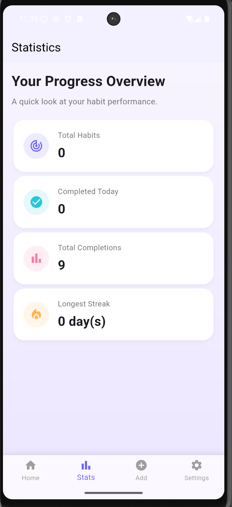
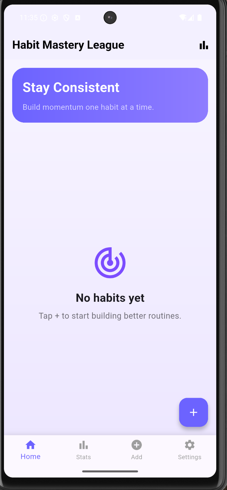

### Add Habit
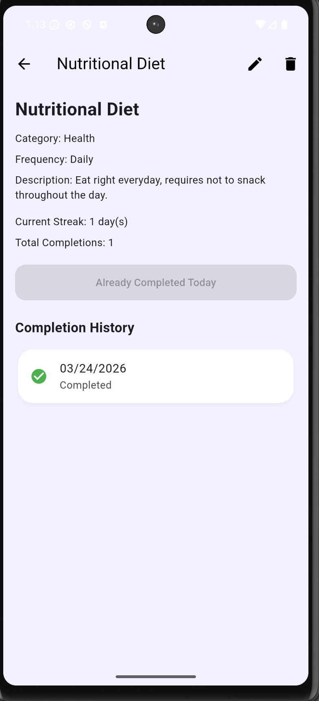

### Statistics
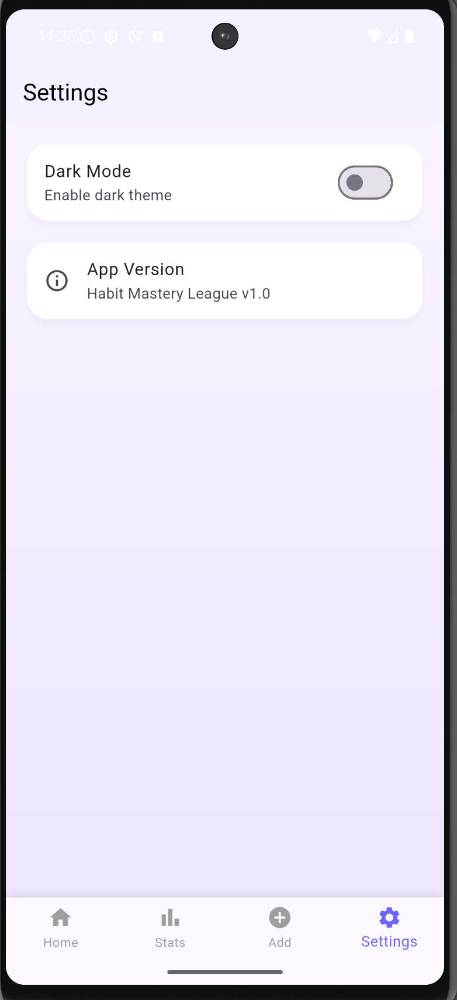
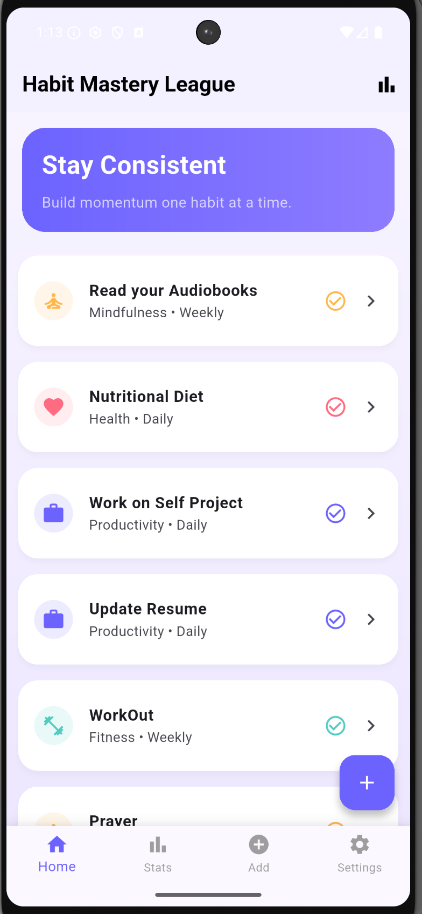

### Habit Details
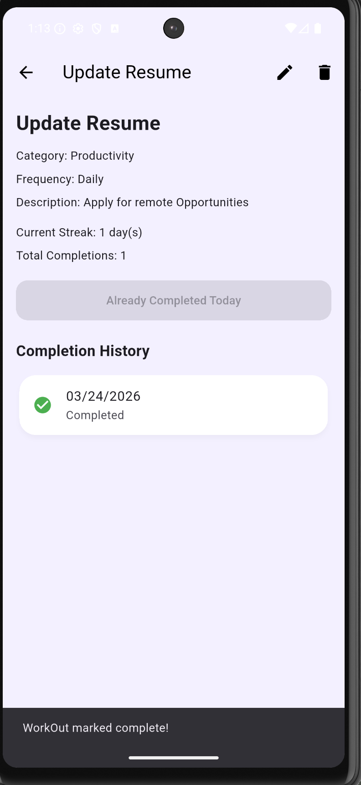
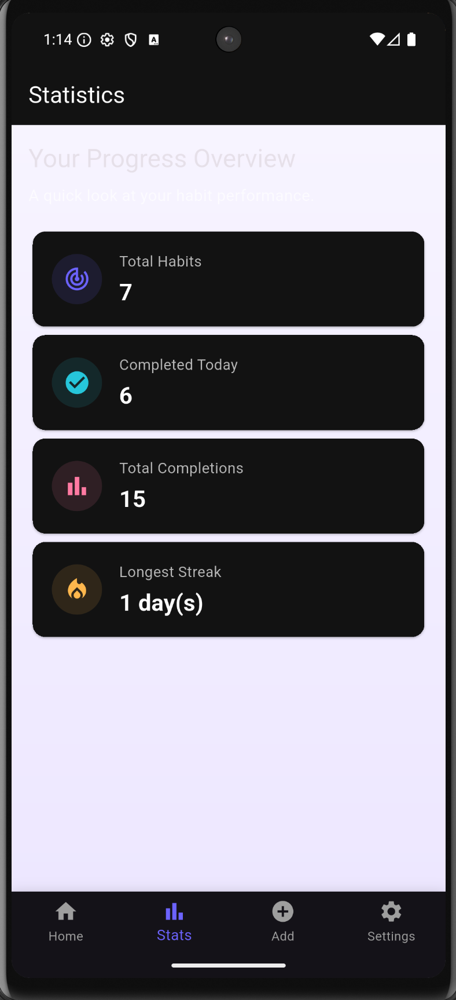

### Settings / Theme Toggle
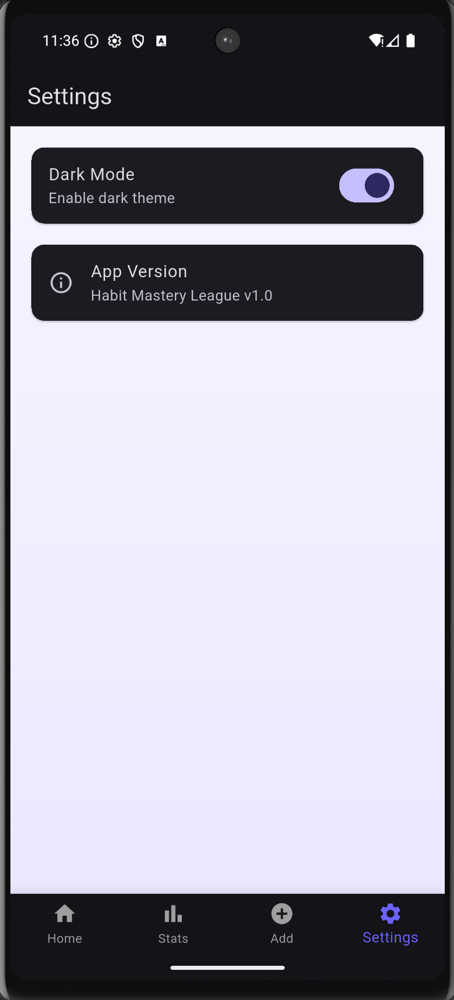
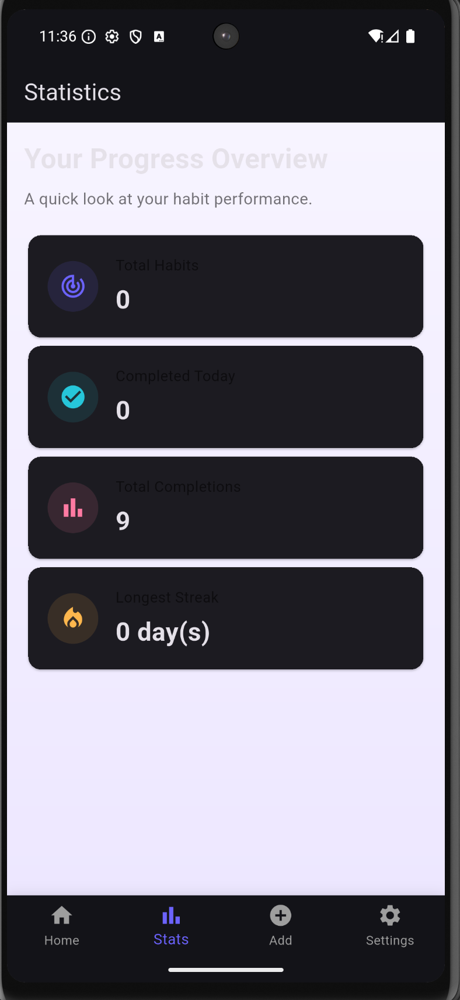

## Wireframes

### Screen Map

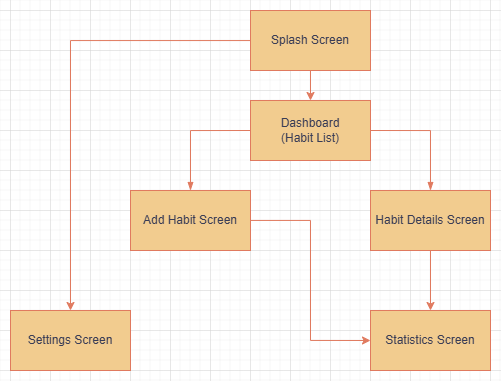

### Add Habit Screen

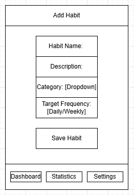

### Project Structure

lib/
├── models/
├── database/
├── screens/
├── services/
└── main.dart

### How to Run

flutter pub get
flutter run

### APK

The latest APK is included in the project for installation on Android devices.

### Contributions

Darin:

UI / Design
Database Schema
Core Features (CRUD, tracking)
Dark Mode Implementation
Sound Integration

Sanaul:

Splash Screen
Sound Feedback
Theme Persistence (IMPORTANT)
Integration Fix (Stats)
